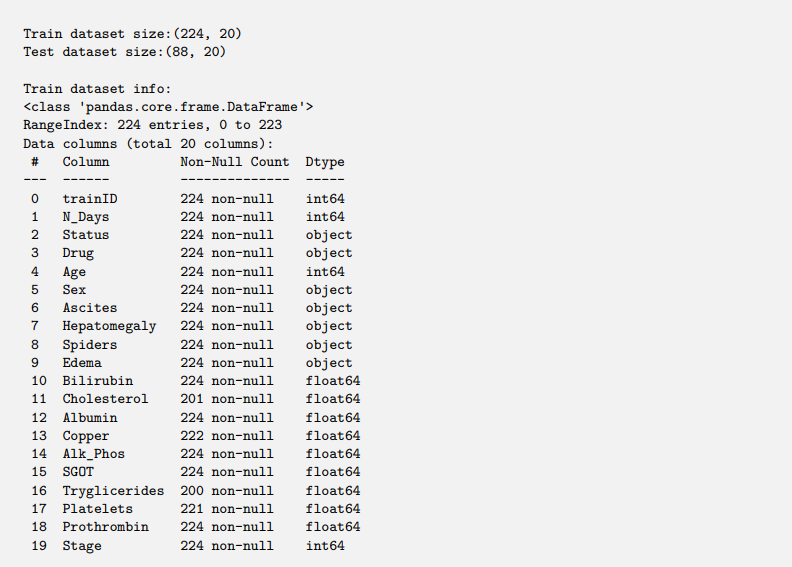
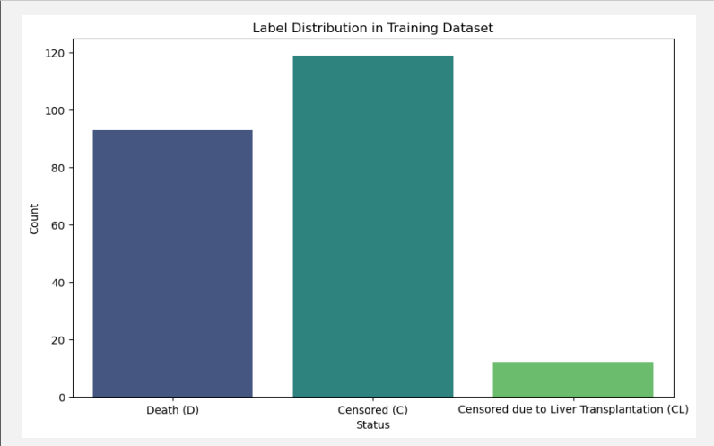
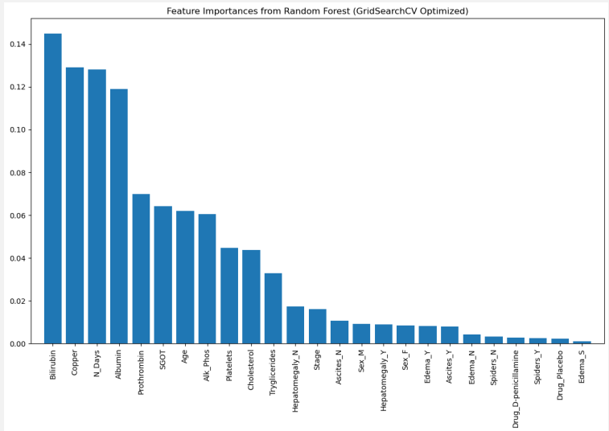
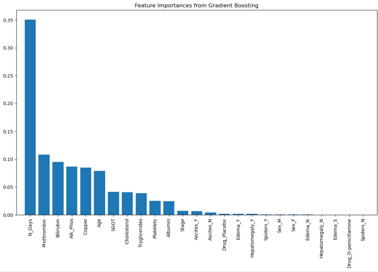

# 🧠 Machine Learning: Predicting Survival Status of Liver Cirrhosis Patients  

Welcome to my **Machine Learning project**! This project focuses on predicting the survival status of patients with liver cirrhosis using clinical data, showcasing feature engineering, model optimization, and insights derived from supervised learning techniques.  

## 🌟 Highlights  

- **📊 Data Analysis**: Preprocessed and explored clinical data to handle missing values and encode features.  
- **🤖 Supervised Models**: Developed Logistic Regression, Random Forest, and Gradient Boosting models.  
- **🎯 Performance Metrics**: Evaluated models with accuracy, precision, recall, and F1-scores.  
- **🔍 Feature Importance**: Identified key clinical features affecting survival predictions.  

## 🛠️ Key Objectives  

1. Preprocess training and test datasets to handle missing values and encode categorical features.  
2. Address label imbalance to improve prediction accuracy for minority classes.  
3. Build and evaluate machine learning models for predicting survival status.  
4. Perform feature importance analysis to uncover influential factors.  

## 📚 The Dataset  

The dataset is derived from the Mayo Clinic study on primary biliary cirrhosis (PBC) and contains 312 patient records (224 training, 88 test). Features include:  

- **Clinical Data**: Age, bilirubin, copper, albumin, platelets, etc.  
- **Target Variable**: Survival status (`D`: Death, `C`: Censored, `CL`: Censored due to liver transplantation).  

Missing values were handled by imputing the mean, and categorical variables were encoded using one-hot and label encoding.  

## 🔬 Analytical Insights  

- **Model Comparison**:  
  - **Logistic Regression**: Accuracy = 80%, baseline performance.  
  - **Random Forest**: Accuracy = 82.22%, robust with optimized hyperparameters.  
  - **Gradient Boosting**: Accuracy = 84.44%, best-performing model.  

- **Feature Importance**:  
  - **Gradient Boosting**: Highlighted `N_Days`, `Prothrombin`, and `Bilirubin` as key features.  
  - **Random Forest**: Emphasized `Bilirubin` and `Copper`.  

## 📈 Visualizations  

- **Label Distribution**: Imbalanced with `Censored (C)` being the majority class.  
- **Feature Importance**: Bar plots showing key predictors from Random Forest and Gradient Boosting models.  

## 📸 Screenshots  

Take a glimpse of the work:  

 
 
   

## 💡 Why This Matters  

This project demonstrates the application of machine learning to medical datasets, providing insights into:  

- 🚀 The importance of handling imbalanced datasets.  
- 🌍 The potential of predictive models to assist in clinical decision-making.  
- 📊 The value of feature importance analysis in identifying key predictors.  

## 📁 Repository Contents  

- **Code Notebook**: Python `.ipynb` file with all steps, explanations, and outputs.  
- **Data**: Preprocessed training and test datasets.  
- **Results**: Model performance metrics and visualizations.  
- **Predictions**: Test set predictions in `test_predictions.csv`.  

## 📬 Contact  

For inquiries or feedback, feel free to reach out at [sathiyanarayanan.s1698@gmail.com](mailto:sathiyanarayanan.s1698@gmail.com).  

---  

If you find this project valuable, don’t forget to ⭐ star the repository! Let's collaborate and explore the wonders of data science together.  
